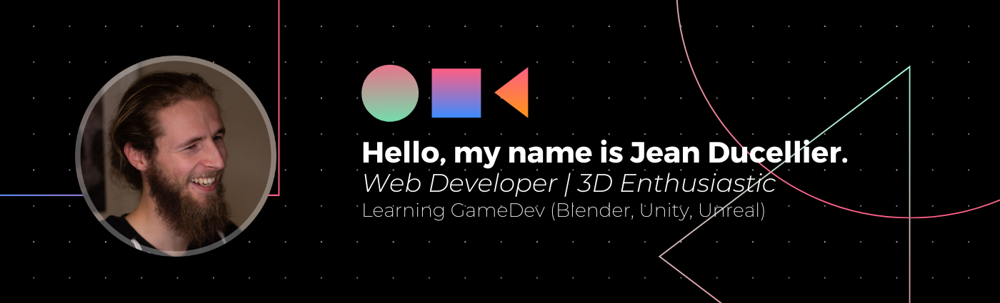

<h1 align="center">Hi , I'm Jean Ducellier</h1>
<h3 align="center">A passionate french Developer 🐓🥖🍷 </h3>

<!-- 
  
 -->

## About Me
I starting my career as a web developer in 2019.   
🎒 My educational background is a bit of a mess... 

 👨‍🎓 I started with a bachelor in computer science in 2015.  
 📉💥 Then, i leave it after 10 weeks, it was not for me.   
 😖 At this point I didn't know what I wanted to do. So I started factory job in different sectors. Such as Amazon fullfielment, slawter house, and a lot of other stuff. Quite borring for me. I don't like to do the same thing everyday.  
 📚 On day after work, I tried an online course on HTML 5 and CSS 3. 
🎉🎉🎉I was hooked. I started to learn more and more about web development.   
 🚀 Then, I realized that I wanted to become a web developer. But somethings steel missing. I start a 6 month training in web development at the wild Code school, in Java / SpringBoot. This training allowed me to make a professional network and get opportunity !   

🔱🔱 Now I'm a full stack developer, and I'm realy happy with Scriptor-Artis! We work together on very cool projects. Just go check it out here : https://scriptor-artis.fr/ ! 
  
As a side project i'm working and learning game dev to realize my dream.... 🎮🎮🎮 
Release my first Video Game and learn lot of things in the process. Such as 3D modeling with blender, 3D game engine such as Unity or Unreal Engine. At this point i didn't know wich one to choose. So i'm learning both.

If you stay curious at this point about what i've done with Blender, I invite you to check [my Instagram here](https://www.instagram.com/jaipasd_blazz/?hl=fr)

🦄🌈 My dream is to create game and share free content to give the power to everyone to create by their own ! 

PS : Totaly close to new opportunity !

### Quick resume 👨‍💻
- 🔭 I’m currently working on [Clavus](https://clavus.io/), [Tzar](https://www.tzar.fr/), [Devana.ia](https://www.devana.ai/) since 2 years at [Scriptor-Artis](https://www.scriptor-artis.com/) and it is awesome !

- 🌱 I’m currently learning **Game Dev with Blender, Unity, Unreal**

- 💬 Ask me about **React, Material-UI, Github, Next, Apollo/GraphQL, Typescript, Prisma** or if you are a young developer or in search of what a developer is ... I will be happy to answer you ! If you want to contact me click on the link below  or via linkedIn for professional purpose ! 

  

 ## 🛠 &nbsp;Languages and Tools :

&nbsp;
&nbsp;
&nbsp;
&nbsp;
&nbsp;

 

&nbsp;

&nbsp;

&nbsp;
&nbsp;
&nbsp;
&nbsp;
&nbsp;
 

 
&nbsp;
&nbsp;
&nbsp;

&nbsp;
&nbsp;
&nbsp;
&nbsp;
&nbsp;

## Connect with me:

